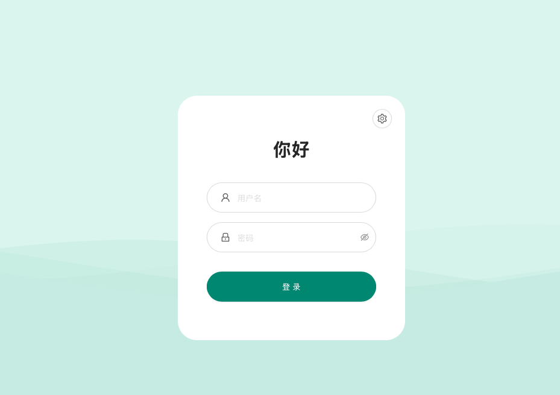
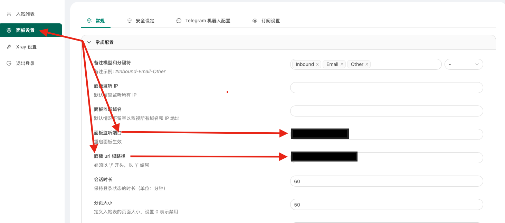
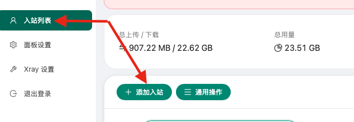
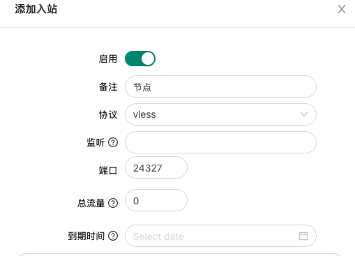
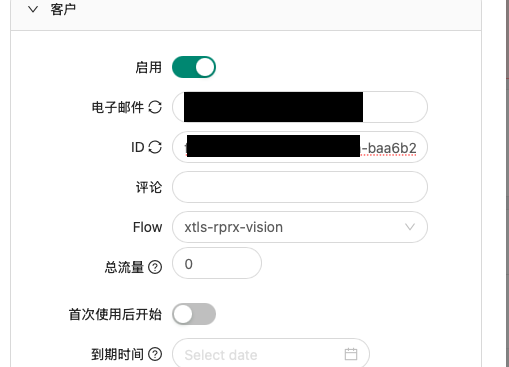
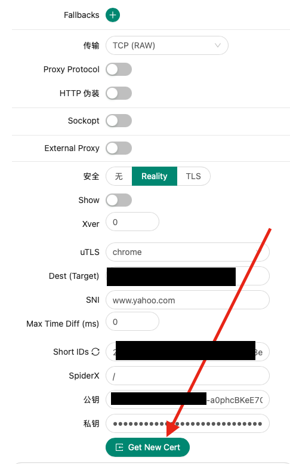

> 使用最简单的方式搭建一个vless reality节点，而不是为了性能最大化。使用3-xui本身就是为了GUI操作简单

**可选项：**

BBR开启和选择模式脚本 （我选14：BBR2+FQ）

```
wget -N --no-check-certificate "https://github.000060000.xyz/tcpx.sh" && chmod +x tcpx.sh && ./tcpx.sh 
```

运行BBR优化脚本（运行脚本之后先选2再运行选3）

```
bash <(curl -Ls https://github.com/lanziii/bbr-/releases/download/123/tools.sh)
```

#### 第一步：安装3x-ui

**安装命令**

```
bash <(curl -Ls https://raw.githubusercontent.com/mhsanaei/3x-ui/master/install.sh)
```

**运行脚本后会有如下提示意思是是否需要自定义配置，键入`y`然后回车；**

```
Do you want to continue with the modification y/n?
```

**会接连出现如下需要自定义的配置**

```
Please set up your username: 后面输入要设置的面板用户名
Please set up your password: 后面输入要设置的面板密码
Please set up the panel port: 后面输入你要设置的面板端口
```

**面板创建完成**

如果需要更改配置如端口号等，在终端输入以下命令即可

```
x-ui
```

#### 第二步：进入面板创建节点

**在浏览器地址栏按照如下格式输入面板地址**

```
vpsip:端口号/面板路径
```

**输入第一步中配置的用户名和密码**



**可以在这里重新设置你的X-UI的端口和面板**



**点击添加入站**



**然后按照下图直接配置就可以**

把图二中客户ID中第一个 ‘-’ 前面的自负复制到图三中Dest(Target)中的.com前面去替换掉原来的字符







> 节点这就搭建好了

#### 第三步：将节点添加到clash

```
proxies:
  - name: "节点名称"
    type: vless
    server: 127.0.0.1             #这里要写节点服务器的公网ip地址
    port: 25024                   #创建节点时设置的端口号
    uuid: 4357ef26-9987-90jx1a-a5df-2151dacc7020   #这里写图二中的ID
    network: tcp
    tls: true
    udp: true
    flow: xtls-rprx-vision
    servername: 4287ef26.com # 这里写图二中的Dest(Target)配置的网址
    reality-opts:
      public-key: FlD9auoJ5TkEydv_mORuZ2SEE6WRGFtTjLz2G1awQXQ #这里写图三中获取的公钥
      short-id: e6d376d33a5cd40c # 这里写图三中的Short IDs
    client-fingerprint: random # cannot be empty
```

